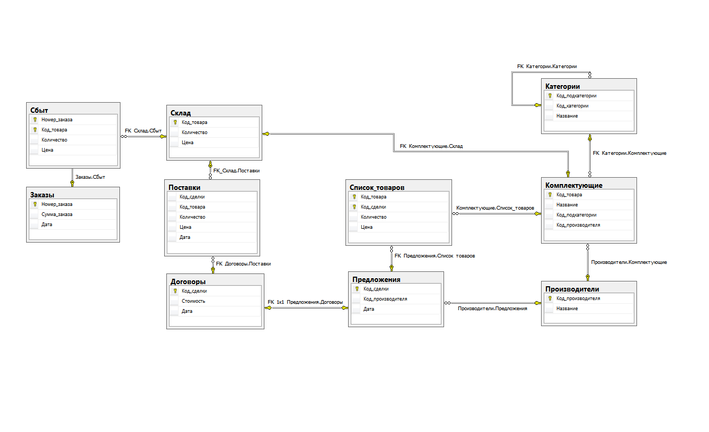

### Учебная работа по проектированию базы данных:
## «Компьютерный магазин»
Магазин торгует компьютерной техникой. Магазин выполняет сборку компьютеров по желанию заказчика из комплектующих, выбираемых им по каталогу (прейскуранту). Комплектующие подразделяются на категории (процессоры, материнские платы и т.д.) таким образом, что в каждом заказе должно присутствовать не более одной позиции по каждой из категорий. Магазин работает на основании дилерских соглашений с ведущими производителями комплектующих, каждый из которых может поставлять комплектующие из нескольких категорий. 

#### Данные разработки:
1. Среда разработки: Microsoft SQL Server 2014 Developer Edition, SQL Server 2014 Management Studio.
2. Требования к выполнению работы:  
Необходимо автоматизировать учет заказов, комплектующих и производителей, вычисление суммы заказа, а также обеспечить выдачу на печать (экран) заказов и следующих отчетных документов: 
    - суммы заказов за период по категориям — для определения изменения спроса на различные категории комплектующих; 
    - суммы заказов по производителям — для определения наиболее популярных и пользующихся спросом Компьютерный магазин моделей и производителей; 
    - суммы заказов по месяцам — для определения динамики продаж.

#### Структура папок репозитория:
   - `../Database` - файлы БД для присоединения;
   - `../ExampleWork` - изображения с примерами работы с БД:
    
     - `./Example 0 - View dbo.Отчет_По_Складу.PNG` - пример работы с представлением (формирование отчёта по складу);
     - `./Example 1 - Procedure add dbo.AddManufacturer.PNG` - пример работы с процедурой (добавление нового производителя комплектующих);
     - `./Example 2 - Procedure work with strings dbo.UpperFirstLetterNameOfCategory - after EXECUTE.PNG` - пример работы с процедурой (корректировка названия категории) - выполнение процедуры;
     - `./Example 2 - Procedure work with strings dbo.UpperFirstLetterNameOfCategory - after CLEAR WORK RESULTS.PNG` - пример работы с функцией (корректировка названия категории) - возврат данных таблицы к исходному состоянию после выполнения процедуры;
     - `./Example 3 - Function table-valued dbo.GoodsOrderByID.PNG` - пример работы с функцией, возвращающей табличное значение (возврат списка товаров конкретного заказа);
     - `./Example 4 - Function scalar dbo.AvgContractValue.PNG` - пример работы со скалярной функцией (возврат информации о средней стоимости договоров за заданный период).
   - `../Images` - изображение диаграммы БД, изображения имеющихся списков имеющихся таблиц, представлений, функций, процедур;
   - `../SqlScripts` - сохранённые скрипты имеющихся функций и процедур (с примерами использования в комментариях):
     - `./Functions` - набор функций:
       - `./Scalar` - скалярные:
          - `./Scalar` - ассеты, которые могут быть использованы проектом на Unity;
       - `./Table-valued` - возвращающие, табличные значение:
     - `./Procedures` - набор процедур:
       - процедуры вида `dbo.Add*.sql` - для добавления данных в таблицы;
       - `dbo.SetNonWorkedManufacturer` / `dbo.CancelNonWorkedManufacturer` - указание/отмена указания производителя комплектующих как неработающего (работа со строками);
       - `dbo.ClearUnnecessarySpacesOfProduct` - корректировка названия комплектующего - удаление лишних пробелов (работа со строками);
       - `dbo.UpperFirstLetterNameOfCategory` / `dbo.UpperFirstLetterNameOfProduct` - корректировка названия категории/комплектующего (работа со строками).
